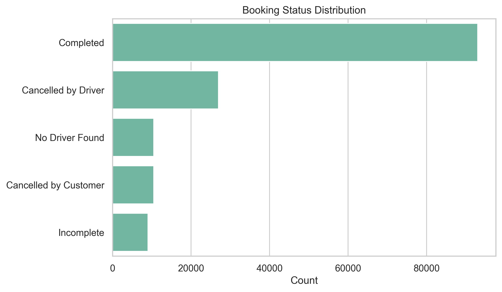
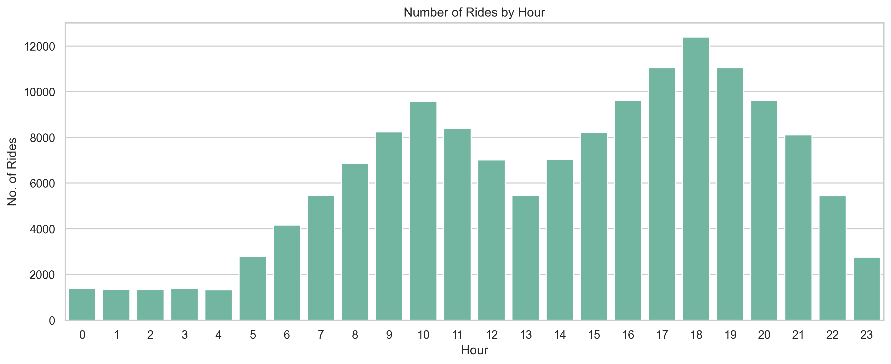
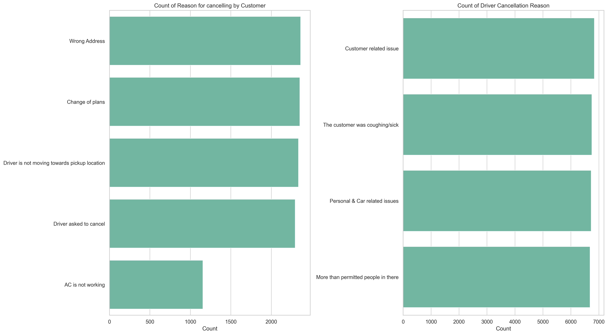

# Uber Data Analysis 🚖📊

## 📌 Project Overview
This project explores ride-hailing platform data to uncover key patterns in booking behaviour, cancellations, ratings, payments, and demand trends.  
The analysis was performed in **Python (Pandas, Matplotlib, Seaborn)** using Jupyter Notebook.  

The goal is to identify business insights and provide actionable recommendations for improving customer experience, driver retention, and overall operational efficiency.

---

## 🗂 Dataset
- Source: (https://www.kaggle.com/datasets/yashdevladdha/uber-ride-analytics-dashboard/data)
- Key columns include:  
  - **Booking Status** (Completed, Cancelled, Incomplete)
  - **Booking Value**  
  - **Ride Distance, Avg CTAT, Avg VTAT**  
  - **Driver & Customer Ratings**  
  - **Payment Method**  
  - **Cancellation Reasons**  
  - **Vehicle Type**  
  - **Pickup/Drop-off Location**

---

## 🔑 Key Takeaways
- **High Service Quality:** Both drivers and customers rate rides highly (avg. >4.2).  
- **Driver Cancellations Dominate:** 72% of cancellations come from drivers, suggesting deeper operational issues.  
- **Demand is Seasonal:** Monthly rides fluctuate heavily, while weekly demand remains stable.  
- **Evening Rush Hour Critical:** Peak demand occurs 4–9 PM, making it the most important window for pricing & driver allocation.  
- **Digital Payments Dominant:** UPI is the most popular payment method, showing strong digital adoption.  

---
## 📊 Sample Visualisations

**Booking Status Distribution**

**Hourly Ride Demand**

**Cancellation Reasons**

---

## 💡 Business Recommendations
- **Reduce Driver Cancellations:** Investigate pickup mismatches, low incentives, and safety concerns to improve reliability.  
- **Enhance Address Validation:** Improve in-app input accuracy to cut down customer cancellations.  
- **Driver Experience Program:** Since driver ratings lag slightly behind customer ratings, address driver friction points (e.g., incentive fairness, safety).  
- **Fleet Reliability:** Implement stricter vehicle maintenance checks to reduce incomplete rides caused by breakdowns.  
- **Peak-Hour Strategy:** Increase driver incentives during 4–9 PM to meet high demand and maximize revenue.  

---

## 📊 Tools & Libraries
- Python 3  
- Pandas  
- Matplotlib  
- Seaborn  

---

## 📂 Repository Structure
┣ 📓 notebook.ipynb # Full analysis & code
┣ 📄 README.md # Project summary (this file)
┗ 📄 requirements.txt # (Optional) dependencies to run notebook
---

✨ **Author**
Linh Nguyen – Data Analyst | Skilled in Python, SQL, Power BI

📧 Email: ntl.nthlinh@gmail.com
💼 LinkedIn: https://www.linkedin.com/in/thuylinhng21/

